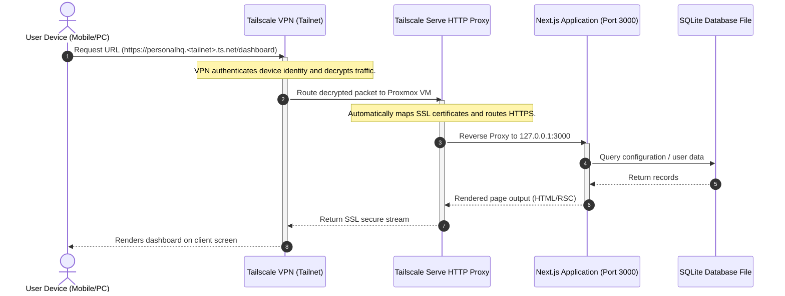
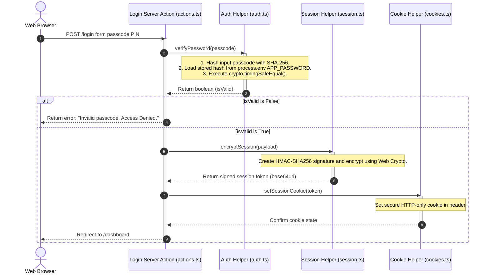
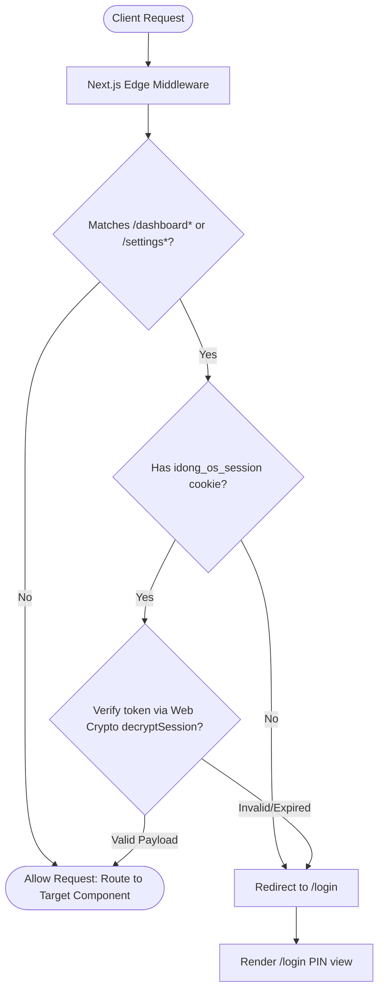

# IDONG OS System Architecture Specification
**Version:** 1.0  
**Author:** Principal Software Architect  
**Status:** Approved  

This document details the system architecture of **IDONG OS**, focusing on the request lifecycle, authentication mechanisms, cryptographically secure session flows, and edge middleware routing constraints.

---

## 1. Global Request Flow

Traffic routed to the application follows a zero-trust network boundary. The server is not exposed to the public internet; instead, it is hosted inside a private home local area network (LAN) and accessed via a Tailscale Virtual Private Network (VPN) tunnel.



---

## 2. Authentication Flow

The system employs a single-user passcode verification scheme. The passcode is stored securely as a SHA-256 hex hash in the environment variables, protecting against plain-text leaks.



---

## 3. Session Flow & Web Crypto API

To bypass Edge Runtime constraints (which forbid synchronous Node `crypto` functions like `pbkdf2Sync` and `createCipheriv`), sessions use the global **Web Crypto API** (`crypto.subtle`). Tokens are signed using **HMAC-SHA256**, ensuring authenticity and preventing user-side payload tampering.

### Token Anatomy
The session token is a period-delimited composite string:
`[PayloadBase64Url].[SignatureBase64Url]`

*   **PayloadBase64Url:** Base64url-encoded string of the session JSON object (e.g. `{ role: "admin", createdAt: 1783678555 }`).
*   **SignatureBase64Url:** Base64url-encoded HMAC-SHA256 signature calculated from the Payload string and `process.env.SESSION_SECRET`.

### Decryption & Verification Algorithm:
```
               [Incoming Token String]
                         │
                         ▼
             Split by period delimiter (.)
             /                           \
            ▼                             ▼
   [Payload Base64]              [Signature Base64]
            │                             │
    JSON Parse text               Convert to Buffer
            │                             │
    [Session Payload]             [Signature Bytes]
            │                             │
            └──────────────┬──────────────┘
                           │
                           ▼
          Run crypto.subtle.verify(HMAC)
                           │
           ┌───────────────┴───────────────┐
           ▼                               ▼
       [IsValid: True]             [IsValid: False]
           │                               │
    Return Payload                    Return null
```

---

## 4. Cookie Lifecycle

To safeguard session validity against cross-site scripting (XSS) and cross-site request forgery (CSRF) vectors, the session cookie is configured with strict security flags:

*   **Cookie Name:** `idong_os_session`
*   **HTTP-Only:** Enabled (`httpOnly: true`). Blocks JavaScript execution environments (e.g., `document.cookie`) from reading the session string, neutralising XSS token extraction.
*   **Secure:** Configured to match environment status (`secure: process.env.NODE_ENV === "production"`). Forces browsers to only transmit cookies over encrypted HTTPS channels in production.
*   **SameSite:** Configured to `SameSite=Strict`. The browser will not send the cookie along with cross-site requests, mitigating CSRF session hijacking.
*   **Expiration:** 30 days (`maxAge: 2592000`). Once expired, browsers purge the cookie, forcing the user to re-authenticate at `/login`.

---

## 5. Middleware Sequence

Every HTTP request routed to the app passes through Next.js Edge Middleware. This serves as the primary route protector, verifying sessions before executing page generation or data loading.


