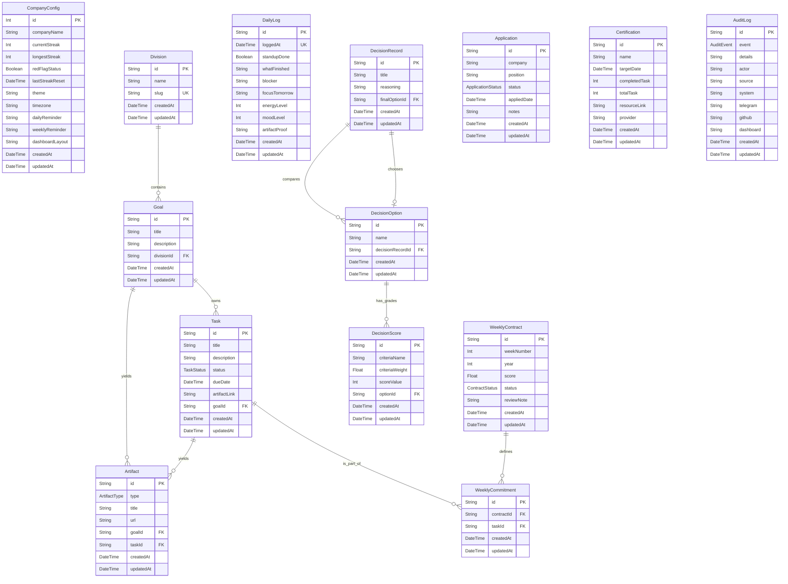

# IDONG OS Database Schema Documentation
**Version:** 1.0 (Database State Sync)  
**Author:** Senior Database Engineer  
**Status:** In Sync with Production Schema  

This document serves as the official specification for the **IDONG OS** database schema. The database runs on **SQLite** and uses **Prisma ORM** as the query builder and migration manager.

---

## Entity Relationship (ER) Diagram

---

## Enums
Since SQLite does not support native database enum types, Prisma stores these as `TEXT` (`String`) columns in the SQLite database but compiles them into strict TypeScript types in the Prisma Client.

### 1. `DivisionSlug`
Defines standard routes/slug variables for the primary organizational categories.
*   `skripsi`
*   `job`
*   `skill`
*   `personal`

### 2. `TaskStatus`
Tracks current operational progress stages for checklists.
*   `TODO`
*   `IN_PROGRESS`
*   `DONE`

### 3. `ContractStatus`
Tracks weekly commitment performance status.
*   `ACTIVE`
*   `COMPLETED`
*   `FAILED`

### 4. `ApplicationStatus`
Defines job recruitment pipelines (Kanban stages).
*   `WISHLIST`
*   `APPLIED`
*   `INTERVIEW`
*   `OFFER`
*   `REJECTED`

### 5. `ArtifactType`
Categorizes physical output evidence uploads.
*   `REPO`
*   `ARTICLE`
*   `DEPLOY`
*   `DESIGN`

### 6. `AuditEvent`
System actions logged in the audit trail.
*   `CREATED_GOAL`
*   `DELETED_TASK`
*   `FINISHED_WEEKLY_CONTRACT`
*   `RESET_STREAK`

---

## Table Specifications & Key Relationships

### 1. `CompanyConfig`
A singleton table (ID constrained to `1`) storing global OS parameters, streaks, and styling preferences.

| Field Name | Type | Key | Nullable | Default | Note / Constraint |
|---|---|---|---|---|---|
| `id` | `Int` | PK | No | `1` | Singleton row lock |
| `companyName` | `String` | | No | `"IDONG OS"` | Customize terminal title |
| `currentStreak` | `Int` | | No | `0` | Active streak count |
| `longestStreak` | `Int` | | No | `0` | Peak historic streak |
| `redFlagStatus` | `Boolean` | | No | `false` | Streak warning state |
| `lastStreakReset` | `DateTime` | | No | `now()` | Chrono pointer for resets |
| `theme` | `String` | | No | `"dark"` | Active layout theme |
| `timezone` | `String` | | No | `"GMT+7"` | Regional timezone parameter |
| `dailyReminder` | `String` | | No | `"08:00"` | Daily cron alert time |
| `weeklyReminder` | `String` | | No | `"08:00"` | Sunday contract alert time |
| `dashboardLayout`| `String` | | No | `"3-column"`| UI column formatting choice |
| `createdAt` | `DateTime` | | No | `now()` | Audit trail timestamp |
| `updatedAt` | `DateTime` | | No | | Auto-updated on write |

---

### 2. `Division`
Organizational partitions representing the 4 key life/work channels.

| Field Name | Type | Key | Nullable | Default | Note / Constraint |
|---|---|---|---|---|---|
| `id` | `String` | PK | No | `uuid()` | Universal identifier |
| `name` | `String` | | No | | e.g. "Skripsi & Riset" |
| `slug` | `DivisionSlug`| UK | No | | Route slug uniqueness |

---

### 3. `Goal`
OKR targets grouped under divisions.

| Field Name | Type | Key | Nullable | Default | Note / Constraint |
|---|---|---|---|---|---|
| `id` | `String` | PK | No | `uuid()` | |
| `title` | `String` | | No | | Objective title |
| `description` | `String` | | Yes | | Details / targets |
| `divisionId` | `String` | FK | No | | Links to `Division.id` |

*   **Relations:**
    *   `divisionId` references `Division.id`. On Division deletion, all associated Goals are deleted (`onDelete: Cascade`).

---

### 4. `Task`
Actionable checklist cards requiring completed proofs.

| Field Name | Type | Key | Nullable | Default | Note / Constraint |
|---|---|---|---|---|---|
| `id` | `String` | PK | No | `uuid()` | |
| `title` | `String` | | No | | |
| `description` | `String` | | Yes | | |
| `status` | `TaskStatus`| | No | `TODO` | State flow validator |
| `dueDate` | `DateTime` | | Yes | | |
| `artifactLink` | `String` | | Yes | | Links completed proof |
| `goalId` | `String` | FK | No | | Links to `Goal.id` |

*   **Relations:**
    *   `goalId` references `Goal.id`. On Goal deletion, all child tasks are deleted (`onDelete: Cascade`).

---

### 5. `WeeklyContract`
Weekly planning contracts tracking commitments and scores.

| Field Name | Type | Key | Nullable | Default | Note / Constraint |
|---|---|---|---|---|---|
| `id` | `String` | PK | No | `uuid()` | |
| `weekNumber` | `Int` | UK | No | | ISO week number |
| `year` | `Int` | UK | No | | ISO year |
| `score` | `Float` | | No | `0.0` | Calculated contract rating |
| `status` | `ContractStatus`| | No | `ACTIVE` | Active contract indicator |
| `reviewNote` | `String` | | Yes | | Written on Sunday evaluations |

*   **Uniqueness:**
    *   `@@unique([weekNumber, year])` enforces that only one contract can be initialized per week.

---

### 6. `WeeklyCommitment`
A junction table mapping target tasks committed to in a weekly contract.

| Field Name | Type | Key | Nullable | Default | Note / Constraint |
|---|---|---|---|---|---|
| `id` | `String` | PK | No | `uuid()` | |
| `contractId` | `String` | FK | No | | Links to `WeeklyContract.id` |
| `taskId` | `String` | FK | No | | Links to `Task.id` |

*   **Relations:**
    *   `contractId` references `WeeklyContract.id` (`onDelete: Cascade`).
    *   `taskId` references `Task.id` (`onDelete: Cascade`).

---

### 7. `DailyLog`
Daily standup record representing exactly one day's performance check.

| Field Name | Type | Key | Nullable | Default | Note / Constraint |
|---|---|---|---|---|---|
| `id` | `String` | PK | No | `uuid()` | |
| `loggedAt` | `DateTime` | UK | No | | The standup logging date |
| `standupDone` | `Boolean` | | No | `true` | |
| `whatFinished`| `String` | | No | | Standup Q1 |
| `blocker` | `String` | | No | | Standup Q2 |
| `focusTomorrow`| `String` | | No | | Standup Q3 |
| `energyLevel` | `Int` | | No | | Integer rating (1-5) |
| `moodLevel` | `Int` | | No | | Integer rating (1-5) |
| `artifactProof`| `String` | | Yes | | Optional screenshot link |

*   **Uniqueness:**
    *   `loggedAt` has a unique constraint to ensure only one standup can be submitted per day.

---

### 8. `DecisionRecord`
Decision Matrix parent tracking thesis choices and selection matrices.

| Field Name | Type | Key | Nullable | Default | Note / Constraint |
|---|---|---|---|---|---|
| `id` | `String` | PK | No | `uuid()` | |
| `title` | `String` | | No | | Decision matrix title |
| `reasoning` | `String` | | Yes | | Explanation of final choice |
| `finalOptionId`| `String` | FK/UK| Yes | | Pointer to winning choice |

*   **Relations:**
    *   `finalOptionId` references `DecisionOption.id`. If the winning option is deleted, the pointer resets to `null` to avoid referential errors (`onDelete: SetNull`).

---

### 9. `DecisionOption`
Candidate alternatives compared in a decision matrix.

| Field Name | Type | Key | Nullable | Default | Note / Constraint |
|---|---|---|---|---|---|
| `id` | `String` | PK | No | `uuid()` | |
| `name` | `String` | | No | | Name of candidate topic |
| `decisionRecordId`| `String`| FK | No | | Parent matrix record ID |

*   **Relations:**
    *   `decisionRecordId` references `DecisionRecord.id`. Deleting a record cascade-deletes its options (`onDelete: Cascade`).

---

### 10. `DecisionScore`
Weighted criteria evaluations for a decision alternative.

| Field Name | Type | Key | Nullable | Default | Note / Constraint |
|---|---|---|---|---|---|
| `id` | `String` | PK | No | `uuid()` | |
| `criteriaName`| `String` | | No | | e.g. "Portfolio Relevance" |
| `criteriaWeight`| `Float` | | No | | Math weight scalar |
| `scoreValue` | `Int` | | No | | Integer rating (e.g. 1-5) |
| `optionId` | `String` | FK | No | | Option ID being scored |

*   **Relations:**
    *   `optionId` references `DecisionOption.id` (`onDelete: Cascade`).

---

### 11. `Application`
Job application pipelines (Kanban columns).

| Field Name | Type | Key | Nullable | Default | Note / Constraint |
|---|---|---|---|---|---|
| `id` | `String` | PK | No | `uuid()` | |
| `company` | `String` | | No | | Company name |
| `position` | `String` | | No | | Target title |
| `status` | `ApplicationStatus`| | No | `WISHLIST` | Kanban stage column |
| `appliedDate` | `DateTime` | | Yes | | |
| `notes` | `String` | | Yes | | |

---

### 12. `Certification`
Sertifikasi module trackers tracking modules.

| Field Name | Type | Key | Nullable | Default | Note / Constraint |
|---|---|---|---|---|---|
| `id` | `String` | PK | No | `uuid()` | |
| `name` | `String` | | No | | Exam Name (e.g. AWS SAA) |
| `targetDate` | `DateTime` | | Yes | | Target test date |
| `completedTask`| `Int` | | No | `0` | Modules completed count |
| `totalTask` | `Int` | | No | `0` | Total modules count |
| `resourceLink` | `String` | | Yes | | Learning portal link |
| `provider` | `String` | | Yes | | e.g. "AWS", "CompTIA" |

---

### 13. `Artifact`
Evidence logs verifying completed work tasks.

| Field Name | Type | Key | Nullable | Default | Note / Constraint |
|---|---|---|---|---|---|
| `id` | `String` | PK | No | `uuid()` | |
| `type` | `ArtifactType`| | No | | |
| `title` | `String` | | No | | |
| `url` | `String` | | No | | Link to commit / file |
| `goalId` | `String` | FK | Yes | | Associated goal reference |
| `taskId` | `String` | FK | Yes | | Associated task reference |

*   **Relations:**
    *   `goalId` references `Goal.id` (`onDelete: SetNull`).
    *   `taskId` references `Task.id` (`onDelete: SetNull`).
    *   Allows deleting tasks or goals without deleting the historic proof records.

---

### 14. `AuditLog`
System transaction logs auditing critical operations.

| Field Name | Type | Key | Nullable | Default | Note / Constraint |
|---|---|---|---|---|---|
| `id` | `String` | PK | No | `uuid()` | |
| `event` | `AuditEvent`| | No | | Audited event category |
| `details` | `String` | | Yes | | JSON string payload details |
| `actor` | `String` | | Yes | | Event trigger actor |
| `source` | `String` | | Yes | | Triggering module source |
| `system` | `String` | | Yes | | System logs metadata |
| `telegram` | `String` | | Yes | | Telegram bot logs metadata |
| `github` | `String` | | Yes | | GitHub webhook logs |
| `dashboard` | `String` | | Yes | | UI dashboard logs |

---

## Index Specifications
To optimize SQLite queries in joins and filters, the following indexes are declared in the schema:

| Index Name | Model Name | Fields Indexed | Rationale |
|---|---|---|---|
| Implicit PK | All Models | `id` | Standard primary key lookup |
| Unique Index| `Division` | `slug` | Unique slug route matches |
| Unique Index| `DailyLog` | `loggedAt` | Restricts to one log per calendar day |
| Unique Index| `WeeklyContract` | `weekNumber, year` | Multi-column uniqueness for week schedules |
| Unique Index| `DecisionRecord` | `finalOptionId` | Enforces single winning choice constraint |
| Index | `Task` | `status` | Filters tasks by active states |
| Index | `Task` | `createdAt` | Feeds recent task activity queues |
| Index | `Task` | `goalId` | Speeds up Goal-to-Task inner joins |
| Index | `DailyLog` | `createdAt` | Queries timeline charts |
| Index | `WeeklyContract`| `status` | Filters active contracts |
| Index | `WeeklyContract`| `createdAt` | Audits weekly contract histories |
| Index | `WeeklyCommitment`| `contractId` | Accelerates joins in weekly reports |
| Index | `WeeklyCommitment`| `taskId` | Relates task completion to contracts |
| Index | `DecisionRecord`| `createdAt` | Sorts matrix records chronologically |
| Index | `DecisionOption`| `decisionRecordId` | Queries candidate choices for a matrix |
| Index | `DecisionScore` | `optionId` | Queries score details for comparison sheets |
| Index | `Application` | `status` | Filters Kanban pipelines by stage columns |
| Index | `Application` | `createdAt` | Queries recent application additions |
| Index | `Certification` | `createdAt` | Tracks certification targets timeline |
| Index | `Artifact` | `createdAt` | Renders timeline proof blocks |
| Index | `Artifact` | `goalId` | Checks deliverables associated with goals |
| Index | `AuditLog` | `createdAt` | Speeds up recent audit log rendering |
