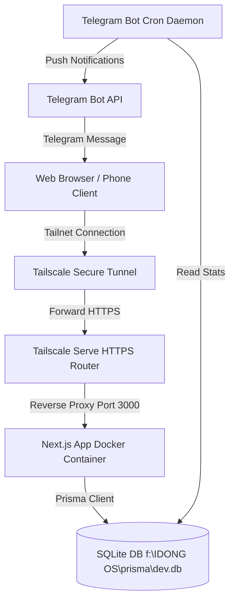
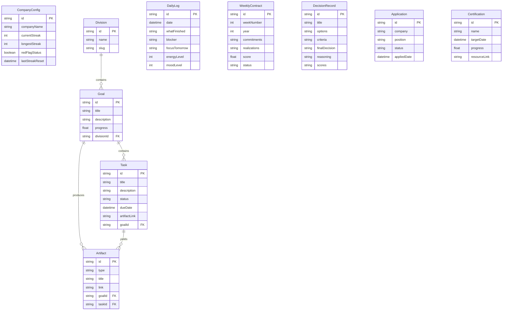

# Engineering Design Document (EDD): IDONG OS
**Version:** 1.0 (Official Release)  
**Author:** Principal Software Architect  
**Status:** Approved for Implementation  

---

## Product Overview

**IDONG OS** is a single-user personal operating system designed to act as an accountability engine and "Company Dashboard" for Idong (the user). It structures his academic tasks (thesis candidate selection and writing) and professional pursuits (job hunting and skill building) into a single, cohesive framework where he operates as both the CEO (strategist) and the Employee (executor).

The primary system objective is to drive progress through an accountability feedback loop, forcing the user to commit to Weekly Contracts, log Daily Standups, and upload verifiable proofs of work (Artifacts) to sustain performance streaks.

---

## Functional Modules

The system is divided into five core functional modules:

```
+-------------------------------------------------------------------+
|                            IDONG OS                               |
+-------------------------------------------------------------------+
|  +-------------------+  +-------------------+  +---------------+  |
|  |  Thesis/Riset     |  |  Job Readiness    |  | Skill Building|  |
|  |  - Decision Matrix|  |  - Kanban Board   |  |  - Homelab    |  |
|  |  - Milestone Trk  |  |  - Skill Gap Trk  |  |  - Tasks      |  |
|  +-------------------+  +-------------------+  +---------------+  |
|  +-------------------+  +-------------------+                     |
|  |  Org & Personal   |  |  Accountability   |                     |
|  |  - Schedule/Events|  |  - Weekly Contract|                     |
|  |                   |  |  - Daily Standup  |                     |
|  +-------------------+  +-------------------+                     |
+-------------------------------------------------------------------+
```

### 1. Thesis & Research Module (Divisi: Skripsi)
*   **Decision Matrix:** Compare thesis topics using a weighted matrix.
*   **Progress Tracker:** Milestone tracking matching academic requirements (Chapters 1-5, Sempro, Sidang, Revisions).
*   **Artifact Log:** Repository link, PDF drafts, and supervisor feedback records.

### 2. Job Readiness Module (Divisi: Job)
*   **Application Kanban:** A classic board (Wishlist, Applied, Interview, Offer, Rejected).
*   **Skill Gap Tracker:** Tracking certifications and modules required for selected career tracks (Cloud/Infra, SOC, MLOps/Edge AI).
*   **Portfolio Checklist:** Track projects with public repositories, clean READMEs, and live deployment links.
*   **Interview Prep Bank:** Log technical and behavioral questions along with drafted responses.

### 3. Skill Building Module (Divisi: Skill)
*   **Homelab Tracker:** Tracks technical milestones linked to long-term infra plans (e.g., CCTV edge detection, single-node k3s, CI/CD pipeline deployments).
*   **Granular Tasks:** Step-by-step technical check-lists (e.g., "Write docker-compose file", "Setup Tailscale auth keys").

### 4. Org & Personal Module (Divisi: Personal)
*   **Calendar/Event Logger:** Tracks obligations related to IMM Adam Malik FKI UMS and graphic design jobs to ensure they do not clash with primary work blocks.

### 5. Accountability Core Module
*   **Weekly Contract:** Sunday night planning form where the user commits to three concrete outputs.
*   **Daily Standup:** Nightly log answering: What was finished (with link), blockers, and the primary focus for tomorrow.
*   **Streak & Flag System:** Tracks consecutive days of completed tasks containing valid artifact links. If no artifact link is provided for 3 consecutive days, the system enters a "Red Flag" warning state and triggers external alerts.
*   **Weekly Review:** Automatically aggregates data from the past week (completed contracts vs. commitments, energy levels, and output counts).
*   **Deadline stakes:** Voluntary consequences tied to milestones (e.g., restriction of gaming privileges if a thesis chapter submission deadline is missed).

---

## System Architecture

> Assumption: The application will be deployed as a single container on a Proxmox VM inside a local Dell T40 server. External traffic will navigate strictly via the Tailscale network (Tailnet).



### Components:
1.  **Frontend & API Engine (Next.js):** Acts as the user interface and back-end logic driver. Next.js App Router API Routes and Server Actions handle all CRUD and streak verification logic.
2.  **Database (SQLite via Prisma):** Chosen over PostgreSQL for the initial phase to maintain a minimal RAM footprint (<10MB DB memory overhead), running directly inside the VM and backed up to a mapped volume.
3.  **Reverse Proxy & HTTPS (Tailscale Serve):** Eliminates complex Nginx/Caddy configurations and public DNS registration. Running `tailscale serve` maps the internal Port 3000 to a Tailnet HTTPS domain (e.g., `https://personalhq.<tailnet-name>.ts.net`) with let's encrypt automatically provisioned by Tailscale.
4.  **Telegram Daemon:** A lightweight Node-based background script that runs standard cron routines to scan the SQLite database and send alerts to the user.

---

## Folder Structure

```
f:/IDONG OS
├── docker-compose.yml
├── Dockerfile
├── package.json
├── tsconfig.json
├── prisma/
│   ├── dev.db                  # Local SQLite database file (ignored in git)
│   └── schema.prisma           # Prisma Data Schema
├── src/
│   ├── app/                    # Next.js App Router
│   │   ├── layout.tsx          # Root Layout (Vercel/Linear-like design system wrappers)
│   │   ├── page.tsx            # Dashboard home overview
│   │   ├── login/              # Single-user passcode verification page
│   │   ├── thesis/             # Thesis management views & Decision Matrix
│   │   ├── job-readiness/      # Kanban board, portfolios, and interview Q&A
│   │   ├── skill-building/     # Homelab milestone check-lists
│   │   ├── weekly-contract/    # Sunday setup and review contracts
│   │   ├── daily-log/          # Daily standup entry form
│   │   └── api/                # REST endpoints (for Telegram bot or data exports)
│   │       └── telegram/       # Endpoint to trigger message actions
│   ├── components/             # Reusable UI components
│   │   ├── ui/                 # shadcn/ui components (Buttons, Dialogs, Cards)
│   │   └── shared/             # Custom compound components (e.g., DecisionMatrix, KanbanBoard)
│   ├── lib/                    # Helper scripts
│   │   ├── db.ts               # Prisma Client singleton
│   │   ├── telegram.ts         # Telegram API client wrappers
│   │   └── utils.ts            # Classnames merger for tailwind
│   └── services/               # Core business logic engines
│       ├── streak.ts           # Integrity streak and Red Flag calculations
│       └── scoring.ts          # Decision Matrix math helpers
└── worker/                     # Separated folder for Cron / Telegram
    ├── src/
    │   ├── jobs/
    │   │   ├── telegram/
    │   │   ├── cron/
    │   │   └── notifications/
    │   ├── config/
    │   ├── db/
    │   ├── utils/
    │   └── index.js
    ├── package.json
```

---

## Database Design

The data layer uses SQLite. All models are defined via Prisma:

```prisma
datasource db {
  provider = "sqlite"
  url      = "file:./dev.db"
}

generator client {
  provider = "prisma-client-name"
}

model CompanyConfig {
  id              String   @id @default("singleton")
  companyName     String   @default("IDONG OS")
  currentStreak   Int      @default(0)
  longestStreak   Int      @default(0)
  redFlagStatus   Boolean  @default(false)
  lastStreakReset DateTime @default(now())
}

model Division {
  id          String   @id @default(uuid())
  name        String   // e.g., "Skripsi & Riset", "Job Readiness"
  slug        String   @unique // "skripsi", "job", "skill", "personal"
  goals       Goal[]
}

model Goal {
  id          String    @id @default(uuid())
  title       String
  description String?
  progress    Float     @default(0.0) // Calculated from completed tasks
  divisionId  String
  division    Division  @relation(fields: [divisionId], references: [id], onDelete: Cascade)
  tasks       Task[]
  artifacts   Artifact[]
  createdAt   DateTime  @default(now())
  updatedAt   DateTime  @updatedAt
}

model Task {
  id           String     @id @default(uuid())
  title        String
  description  String?
  status       String     @default("TODO") // "TODO", "IN_PROGRESS", "DONE"
  dueDate      DateTime?
  artifactLink String?    // Stores the proof (GitHub/Docs URL)
  goalId       String
  goal         Goal       @relation(fields: [goalId], references: [id], onDelete: Cascade)
  artifacts    Artifact[]
  createdAt    DateTime   @default(now())
  updatedAt    DateTime   @updatedAt
}

model DailyLog {
  id             String   @id @default(uuid())
  date           DateTime @unique // Truncated to YYYY-MM-DD
  standupDone    Boolean  @default(true)
  whatFinished   String   // Standup Question 1
  blocker        String   // Standup Question 2
  focusTomorrow  String   // Standup Question 3
  energyLevel    Int      // 1 to 5
  moodLevel      Int      // 1 to 5
  artifactProof  String?  // Optional global link
}

model WeeklyContract {
  id           String   @id @default(uuid())
  weekNumber   Int      // ISO Week number
  year         Int
  commitments  String   // JSON Array representing committed outputs
  realizations String?  // JSON Array representing actual completed tasks
  score        Float    @default(0.0) // Calculation of met vs missed
  status       String   @default("ACTIVE") // "ACTIVE", "COMPLETED", "FAILED"
  reviewNote   String?
  createdAt    DateTime @default(now())
}

model DecisionRecord {
  id            String   @id @default(uuid())
  title         String
  options       String   // JSON string storing options list
  criteria      String   // JSON string storing weighted criteria
  finalDecision String?  // Chosen option name
  reasoning     String?  // Explanation for the choice
  scores        String   // JSON string caching calculated scores
  createdAt     DateTime @default(now())
}

model Application {
  id          String    @id @default(uuid())
  company     String
  position    String
  status      String    @default("WISHLIST") // "WISHLIST", "APPLIED", "INTERVIEW", "OFFER", "REJECTED"
  appliedDate DateTime?
  notes       String?
  updatedAt   DateTime  @updatedAt
}

model Certification {
  id           String    @id @default(uuid())
  name         String
  targetDate   DateTime?
  completedTask

/

totalTask
  resourceLink String?
}

model Artifact {
  id        String   @id @default(uuid())
  type      String   // "REPO", "ARTICLE", "DEPLOY", "DESIGN"
  title     String
  link      String
  goalId    String?
  goal      Goal?    @relation(fields: [goalId], references: [id], onDelete: SetNull)
  taskId    String?
  task      Task?    @relation(fields: [taskId], references: [id], onDelete: SetNull)
  createdAt DateTime @default(now())
}
```

---

## Entity Relationship Diagram



---

## API Design

All endpoints are built as REST endpoints or Next.js Server Actions. For clear architecture, they are documented below as standardized JSON API endpoints:

### Authentication (Single User Bypass)
*   `POST /api/auth/login`
    *   **Payload:** `{ passcode: "string" }`
    *   **Response:** `200 OK` (Sets cookie session) | `401 Unauthorized`

### Accountability Core
*   `GET /api/dashboard/stats`
    *   **Response:** Aggregated data (current streak, red flag warning status, weekly goals completion rate, active job pipelines).
*   `POST /api/standup`
    *   **Payload:** `{ whatFinished: string, blocker: string, focusTomorrow: string, energyLevel: number, moodLevel: number, artifactLink?: string }`
    *   **Response:** `201 Created` (Saves log and updates config streak)
*   `POST /api/weekly-contract`
    *   **Payload:** `{ weekNumber: number, year: number, commitments: string[] }`
    *   **Response:** `201 Created`

### Divisions
*   `POST /api/decisions`
    *   **Payload:** `{ title: string, options: array, criteria: array }`
    *   **Response:** Runs weighted matrix, returns scored recommendations, and logs record.
*   `PATCH /api/tasks/:id`
    *   **Payload:** `{ status: "TODO"|"IN_PROGRESS"|"DONE", artifactLink?: string }`
    *   **Response:** Updates task state. If status changed to `DONE` and `artifactLink` is missing, returns status `200 OK` but logs message warning that streak integrity requires verification.

---

## Authentication Strategy

> Assumption: Tailscale secures transport and network layer entry. Application-level authentication only needs to protect against local devices or shared sessions on logged-in network devices.

*   **Mechanism:** Single session passcode.
*   **Storage:** A hashed version of the system PIN/Passcode will be stored as an environment variable (`APP_PASSWORD`).
*   **Verification Flow:** 
    1. User hits password page.
    2. Input PIN is validated against `process.env.APP_PASSWORD` using a secure comparison function.
    3. On match, a session JWT containing a signed payload `{ role: "admin" }` is stored in an HTTP-only, secure, SameSite=Strict cookie with a 30-day expiration.
    4. Middleware checks for this cookie on all `/dashboard` sub-paths.

---

## State Management

Next.js is predominantly server-driven, minimizing client-side state complexity:
*   **Server State:** Data mutations trigger Next.js Server Action revalidations (`revalidatePath` or `revalidateTag`), instantly fetching fresh records from SQLite and rendering them on the server.
*   **Client State:** Local component states (e.g., Kanban card drag states, dynamic decision matrix input sliders) are managed locally using React `useState` hooks.
*   **Global Layout State:** Theme states (Dark/Light mode toggles) are persisted in `localStorage` and managed using standard `next-themes` bindings.

---

## UI Architecture

Visual guidelines are strictly drawn to prevent generic "AI Slop" style and align with sleek developer dashboards (e.g., Linear/Notion):

```
+-----------------------------------------------------------------------------------+
| IDONG OS  [Streak: 5 Days 🔥]                              [System: Healthy Green]|
+-----------------------------------------------------------------------------------+
|  [ Thesis ]                 [ Job Readiness ]            [ Daily Standup ]        |
|  Current Choice:            Job Pipelines:               Status: Pending Nightly  |
|  -> Smart City (Recomended)  [Wishlist  (4)]             [ Log Daily Standup ]    |
|  Milestones: 4/5 Complete   [Applied   (2)]                                       |
|                             [Interview (1)]              [ Weekly Contract ]      |
|  [ Skill Building ]         [Offer     (0)]              Weekly Commitments:      |
|  Sertifikasi: AWS SAA-C03                                1. Commit draft thesis   |
|  Progress: [====---] 60%    [ Personal/Org ]             2. Setup ArgoCD VM       |
|                             IMM Meet: Wed 19:30          3. Applied 2 job sites   |
+-----------------------------------------------------------------------------------+
```

### Aesthetic Specifications:
*   **Color Palette:** Limit UI colors. Deep Charcoal dark background (`#0b0b0f`), Slate accents (`#1e1e24`), and highly constrained alert signals (Vibrant Emerald for completed streaks, Warning Amber for blockers, Crimson Red for "Red Flag" streak breaks).
*   **Typography:** [Outfit](https://fonts.google.com/specimen/Outfit) for large headings/metric readouts, paired with [Geist Mono](https://vercel.com/font/mono) for technical tasks, links, and code/commit reposs.
*   **Borders & Shadowing:** Strict borders (`1px solid border-color`), no drop shadows, and sharp card structures (`border-radius: 6px`).
*   **Responsiveness:** Fluid grid design. Converts from a three-column dashboard layout on desktop screens to a stacked single-column view on mobile screens.

---

## Deployment Strategy

Deployment uses Docker Compose targeting a single VM on the Proxmox host.

### Docker Compose Schema (`docker-compose.yml`):
```yaml
services:
  app:
    build: .
    ports:
      - "3000:3000"
    environment:
      - DATABASE_URL=file:/data/dev.db
      - APP_PASSWORD=hash_here
      - TELEGRAM_BOT_TOKEN=token_here
      - TELEGRAM_CHAT_ID=id_here
    volumes:
      - personalhq_data:/data
    restart: unless-stopped

  telegram-worker:
    build:
      context: ./worker
    environment:
      - DATABASE_URL=file:/data/dev.db
      - TELEGRAM_BOT_TOKEN=token_here
      - TELEGRAM_CHAT_ID=id_here
    volumes:
      - personalhq_data:/data
    restart: unless-stopped

volumes:
  personalhq_data:
```

### Tailscale Routing Configuration:
Exposing the dashboard requires executing a background daemon inside the VM:
```bash
tailscale serve https / 3000
```
This sets up Tailscale's secure proxy tunnel, routing remote HTTPS requests through to port 3000 locally.

### Backup Strategy:
> Assumption: Backups are scheduled locally but stored off-host to guarantee data durability.
A cron job runs on the host Proxmox server or VM every night at 03:00 local time:
1. Performs SQLite backup: `sqlite3 /var/lib/docker/volumes/personalhq_data/_data/dev.db ".backup '/backup/backup-$(date +%F).db'"`
2. Copies backup artifact using `scp` or web hook upload to off-site cloud storage or secondary storage partition.

---

## Logging Strategy

*   **Server-Side:** Structured console logs outputting execution parameters, SQL executions (via Prisma middleware/logger config), and session authorization attempts.
*   **Telegram Incident Log:** Rather than hosting heavy monitoring stacks (Sentry/Elastic), runtime server errors will trigger an alert module routing error stacks directly to the user's Telegram Chat.

Audit Log : 
created goal
deleted task
finished weekly contract
reset streak
---

## Error Handling Strategy

*   **Database Transactions:** Critical updates (like completing a Weekly Contract and incrementing streaks) wrap within explicit `$transaction` queries in Prisma.
*   **React Boundary Layer:** Views wrap in Next.js `error.tsx` layouts, catching runtime component exceptions and rendering clean fallback diagnostics.
*   **API Failures:** Middleware intercepts all API calls, returning standardized JSON structures:
    ```json
    { "success": false, "error": "Descriptive reason for error" }
    ```

---

## Security Considerations

1.  **Network Isolation:** Bind Docker container to loopback interface `127.0.0.1:3000` to prevent access from non-Tailscale local network adapters.
2.  **API Rate Limiting:** Apply basic express-rate-limit equivalents to API endpoints to prevent brute-force attacks on the single passcode authentication.
3.  **Sanitization:** Strictly enforce parameterized SQLite requests via Prisma to eliminate risk of SQL Injection.

---

## Testing Strategy

*   **Integration Tests:** Set up Vitest tests simulating the "Streak Engine." Test edge cases:
    *   Incrementing streak when DailyLog contains an artifact link.
    *   Streak reset to 0 when daily log is missing 3 consecutive days.
    *   Triggering warning state flags.
*   **Manual/E2E Verification:** Run playwright assertions simulating dashboard CRUD loops (e.g. creating tasks, scoring thesis options, updating Kanban card stages).

---

## Coding Standards

*   **Languages:** Strict TypeScript (with `noImplicitAny` enabled).
*   **Naming Conventions:** camelCase for functions/variables, PascalCase for components, UPPER_SNAKE_CASE for environment configurations.

*   **Prisma Integrity:** Always use explicit migration steps (`prisma migrate dev`) during local development; direct db pushes are prohibited.
AppConfig :
Timezone : GMT+7
theme : "light" | "dark"
daily reminder : "08:00" |
weekly reminder : "08:00"
dashboard layout : "2-column" | "3-column"

---

## Future Scalability

1.  **PostgreSQL Migration:** Can be completed instantly by switching the database provider in `schema.prisma` and spinning up a Postgres image inside `docker-compose.yml`.
2.  **k3s Transition:** If upgrading the homelab stack, the Next.js container can be deployed to a Kubernetes manifest with persistent volume claims, utilizing ArgoCD to hook deployment state to GitHub repository pushes.

---

## Summary of Architect Assumptions

During design phase formulation, the following assumptions were made:
1.  **User Access:** Assumed to be purely single-tenant. No multi-user onboarding or ACL database design was formulated.
2.  **Infrastructure:** Assumed deployment host operates tailscale directly inside a Linux-based Virtual Machine.
3.  **Artifact Integrity Validation:** Validating proof is assumed to be passive verification (verifying string formatting matches URL structures like `github.com/` or file schemas) rather than dynamic GitHub API pings. This mitigates offline blockages and rate limit issues.
4.  **Telegram Bot Flow:** Assumed telegram bot functions as a daemon process run inside a sibling container accessing the identical shared volume SQLite database file.
5.  **Local Timezone:** Operating under GMT+7 timezone constraints, defining daily standup cutoff periods at 22:00 local time.