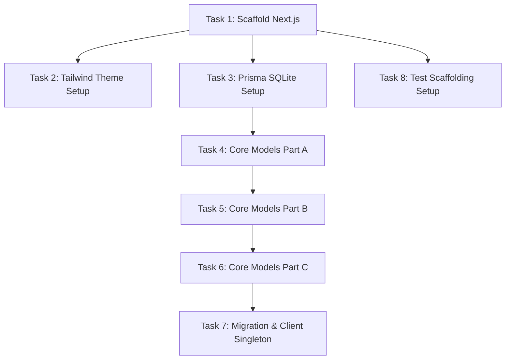

# Milestone 1.1 Decomposed Tasks: Next.js App & Prisma SQLite Setup
**Role:** Senior Software Engineer  
**Specification:** 01-Foundation  

This document breaks down Milestone 1.1 into granular implementation tasks. Each task is sized to take **under 2 hours**, modifies a highly isolated set of files, and includes clear acceptance criteria.

---

## Task List

### Task 1: Scaffold Base Next.js App with Strict TypeScript
*   **Goal:** Create the initial Next.js project core files with strict linting and compilation configurations.
*   **Estimated Effort:** 1 Hour
*   **Files Affected:**
    *   `package.json` [NEW]
    *   `tsconfig.json` [NEW]
    *   `next.config.mjs` [NEW]
*   **Acceptance Criteria:**
    *   `package.json` defines standard scripts (`dev`, `build`, `start`, `lint`) using Next.js 14+ dependencies.
    *   `tsconfig.json` configures strict rules: `"strict": true`, `"noImplicitAny": true`, `"strictNullChecks": true`.
    *   `npm run build` runs with zero syntax or compiler errors.
*   **Dependencies:** None.

---

### Task 2: Configure Global Tailwind CSS & Theme Layout
*   **Goal:** Integrate Tailwind CSS directives, setup CSS variables for the Vercel/Linear dark theme, and map custom typography fonts.
*   **Estimated Effort:** 1.5 Hours
*   **Files Affected:**
    *   `tailwind.config.ts` [NEW]
    *   `src/app/globals.css` [NEW]
    *   `src/app/layout.tsx` [NEW]
*   **Acceptance Criteria:**
    *   `globals.css` has Tailwind base imports and defines color variables (deep charcoal background `#0b0b0f`, slate card accents `#1e1e24`, bright emerald/amber/crimson alerts).
    *   `layout.tsx` imports Google Fonts **Outfit** and **Geist Mono** using `next/font/google` and configures them as default body font families.
    *   Developing local views shows accurate custom utility colors (e.g., class `bg-background` matches the hex background).
*   **Dependencies:** Task 1

---

### Task 3: Initialize Prisma ORM
*   **Goal:** Setup Prisma ORM dependency paths, configuration files, and bind database connection parameters.
*   **Estimated Effort:** 1 Hour
*   **Files Affected:**
    *   `package.json` [MODIFY]
    *   `prisma/schema.prisma` [NEW]
    *   `.env` [NEW]
*   **Acceptance Criteria:**
    *   `prisma/schema.prisma` specifies `provider = "sqlite"` and routes to `env("DATABASE_URL")`.
    *   `.env` lists `DATABASE_URL="file:./dev.db"`.
    *   Running `npx prisma validate` reports schema configuration is correct.
*   **Dependencies:** Task 1

---

### Task 4: Define Core Models in Prisma (Part A)
*   **Goal:** Add the global company settings, organizational divisions, and parent OKR entities (`CompanyConfig`, `Division`, `Goal`) into the Prisma file.
*   **Estimated Effort:** 1.5 Hours
*   **Files Affected:**
    *   `prisma/schema.prisma` [MODIFY]
*   **Acceptance Criteria:**
    *   `CompanyConfig` has default values matching EDD requirements (`currentStreak = 0`, `redFlagStatus = false`).
    *   `Division` matches slugs exactly (`skripsi`, `job`, `skill`, `personal`).
    *   `Goal` features a cascade-delete reference mapping to `Division`.
    *   `npx prisma validate` compiles with zero relation warnings.
*   **Dependencies:** Task 3

---

### Task 5: Define Core Models in Prisma (Part B)
*   **Goal:** Extend the schema definition by adding core accountability tracking models (`Task`, `DailyLog`, `WeeklyContract`).
*   **Estimated Effort:** 1.5 Hours
*   **Files Affected:**
    *   `prisma/schema.prisma` [MODIFY]
*   **Acceptance Criteria:**
    *   `Task` has default status `TODO` and maps to `Goal` using a cascade-delete relation.
    *   `DailyLog` defines standup answer fields, energy and mood levels.
    *   `WeeklyContract` stores array parameters (commitments, realizations) represented as standard JSON strings.
    *   `npx prisma validate` returns no relationship errors.
*   **Dependencies:** Task 4

---

### Task 6: Define Core Models in Prisma (Part C)
*   **Goal:** Complete the schema definition with helper modules (`DecisionRecord`, `Application`, `Certification`, `Artifact`).
*   **Estimated Effort:** 1.5 Hours
*   **Files Affected:**
    *   `prisma/schema.prisma` [MODIFY]
*   **Acceptance Criteria:**
    *   `DecisionRecord` includes options and scoring parameters mapped to JSON strings.
    *   `Application` includes pipeline stage definitions.
    *   `Certification` correctly structures integer parameters `completedTask` and `totalTask` instead of floating progress.
    *   `Artifact` relations with `Goal` and `Task` are set up using `onDelete: SetNull` rules.
    *   `npx prisma validate` reports validation success.
*   **Dependencies:** Task 5

---

### Task 7: Generate Prisma Client & Setup Singleton
*   **Goal:** Execute the initial migrations, construct the physical SQLite database file, and instantiate a shared database client.
*   **Estimated Effort:** 1 Hour
*   **Files Affected:**
    *   `prisma/dev.db` [NEW]
    *   `src/lib/db.ts` [NEW]
*   **Acceptance Criteria:**
    *   Running `npx prisma migrate dev --name init` finishes successfully, generating the initial migration file under `prisma/migrations/`.
    *   `src/lib/db.ts` implements a global PrismaClient instance singleton checking `globalThis` to prevent connection leaks during Next.js hot-reloads.
*   **Dependencies:** Task 6

---

### Task 8: Configure Test Framework Runners (Vitest & Playwright)
*   **Goal:** Setup and configure Vitest and Playwright runners for local execution.
*   **Estimated Effort:** 1.5 Hours
*   **Files Affected:**
    *   `package.json` [MODIFY]
    *   `vitest.config.ts` [NEW]
    *   `playwright.config.ts` [NEW]
*   **Acceptance Criteria:**
    *   Running `npm run test` executes Vitest and reports passes on a simple mock assertion file.
    *   Running `npx playwright test` initializes test runs successfully.
*   **Dependencies:** Task 1
